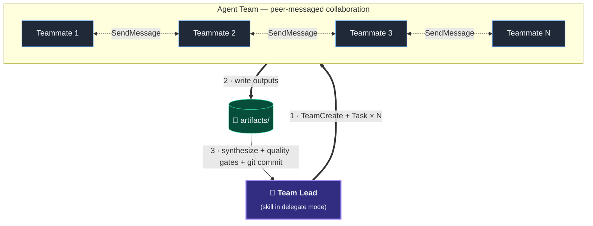

# Galaxy Maps — Skill Bundle Installer

One-step installers for [Galaxy Maps](https://galaxymaps.io) curriculum-creation stack using LLM Skills.

Galaxy Maps ships in **two flavours**, each is a coordinated bundle of 7 Claude Code skills:

| Bundle | What it does | Best for |
|---|---|---|
| **Non-team** | Sequential, single-agent workflow. One orchestrator drives each phase end-to-end. | Quick maps. Predictable cost. Results feel just as good if not better. |
| **Agent Teams** | Multi-agent workflow using Claude Code's Agent Teams. 7 selectable design teams (Dewey, Vygotsky, …) collaborate; 4 adversarial reviewers debate; 1 builder per star. | Comparative design using education experts. Extremely heavy token usage. Mixed results, feels overly verbose. |

Pick one — or install both side-by-side and decide per project.

---

## How the skills fit together

Both bundles run the same 7-phase pipeline. The orchestrator drives the workflow and hands off to one specialist skill per phase. The **Agent Teams** bundle adds team coordination *inside* phases 2–6: each skill spawns a sub-team of teammates (or competing reviewers) that collaborate via peer messaging, while the orchestrator runs in delegate mode and synthesizes results.

```mermaid
flowchart TB
    user(["👤 User"]) -->|"/galaxy-map"| orch

    orch["🎯 <b>Orchestrator</b><br/><code>gm-agent-01-orchestrator</code><br/><sub><i>or</i> <code>-01a-…with-agent-teams</code> for the team bundle</sub>"]

    orch --> p1

    p1["<b>Phase 1 · Intent</b> &nbsp;·&nbsp; <i>single session</i><br/><code>gm-agent-02-intent</code><br/><sub>6-canvas framework — identical in both bundles</sub>"]

    p2["<b>Phase 2 · Curriculum</b><br/><code>gm-agent-03-curriculum</code> &nbsp;<i>or</i>&nbsp; <code>-03a-…with-agent-teams</code><br/><sub><b>non-team:</b> 3 alternatives → user picks one</sub><br/><sub><b>teams:</b> pick 1+ of 7 design teams (Dewey, Vygotsky, …) → consensus MAP per team</sub>"]

    p3["<b>Phase 3 · Curriculum Critique</b> &nbsp;·&nbsp; <i>optional, repeatable</i><br/><code>gm-agent-04-curriculum-critiquer</code> &nbsp;<i>or</i>&nbsp; <code>-04a-…</code><br/><sub><b>non-team:</b> single critiquer, interactive approve / decline / modify</sub><br/><sub><b>teams:</b> 4 adversarial reviewers debate (Pedagogy · Learner · Scope · Devil's)</sub>"]

    p4["<b>Phase 4 · Branching</b> &nbsp;·&nbsp; <i>optional</i><br/><code>gm-agent-05-branching</code> &nbsp;<i>or</i>&nbsp; <code>-05a-…</code><br/><sub><b>non-team:</b> solo generator</sub><br/><sub><b>teams:</b> 1 teammate per Star · peer-messaged de-duplication</sub>"]

    p5["<b>Phase 5 · Missions</b><br/><code>gm-agent-06-mission-builder</code> &nbsp;<i>or</i>&nbsp; <code>-06a-…</code><br/><sub><b>non-team:</b> parallel sub-agent per Star</sub><br/><sub><b>teams:</b> 1 teammate per Star · peer-messaged terminology &amp; style</sub>"]

    p6["<b>Phase 6 · Mission Critique</b> &nbsp;·&nbsp; <i>optional, repeatable</i><br/><code>gm-agent-07-mission-critiquer</code> &nbsp;<i>or</i>&nbsp; <code>-07a-…</code><br/><sub><b>non-team:</b> interactive, per mission</sub><br/><sub><b>teams:</b> 4 cross-referencing reviewers (Technical · Learning Design · Engagement · Audience)</sub>"]

    p7["<b>Phase 7 · Finalize</b> &nbsp;·&nbsp; <i>single session</i><br/>orchestrator transforms repo → <code>GALAXY_MAP.json</code>"]

    p1 --> p2 --> p3 --> p4 --> p5 --> p6 --> p7
    p3 -. "refine" .-> p2
    p6 -. "regenerate" .-> p5

    p7 --> save(["📦 <code>saveGalaxyMap()</code> → <code>courseId</code>"])

    classDef phase fill:#1f2937,stroke:#60a5fa,stroke-width:1px,color:#f3f4f6;
    classDef lead  fill:#312e81,stroke:#a78bfa,stroke-width:2px,color:#f3f4f6;
    classDef io    fill:#064e3b,stroke:#34d399,stroke-width:1px,color:#f3f4f6;
    class p1,p2,p3,p4,p5,p6,p7 phase;
    class orch lead;
    class user,save io;
```



### What happens inside an Agent Team phase

Phases 2, 3, 4, 5, and 6 of the `-with-agent-teams` bundle each follow the same internal pattern:



Team size and roles vary per phase:

| Phase | Teammates | Role pattern |
|---|---|---|
| 2 · Curriculum | 4–5 theorists per team, 7 teams selectable | Each team produces ONE consensus MAP |
| 3 · Curriculum Critique | 4 reviewers | Adversarial lenses debate via peer messaging |
| 4 · Branching | 1 per Star (dynamic) | De-duplicate branch topics across stars |
| 5 · Missions | 1 per Star (dynamic) | Align terminology, running examples, visual style |
| 6 · Mission Critique | 4 reviewers | Cross-reference compound problems across missions |

---

## Install — Non-team bundle

**macOS / Linux / WSL**

```bash
curl -fsSL https://raw.githubusercontent.com/Galaxy-Maps/gm-agent-galaxy-map-creator-skill-install/main/install-non-team.sh | bash
```

**Windows (PowerShell)**

```powershell
irm https://raw.githubusercontent.com/Galaxy-Maps/gm-agent-galaxy-map-creator-skill-install/main/install-non-team.ps1 | iex
```

Clones these 7 repos into `~/.claude/skills/`:

- [`gm-agent-01-orchestrator`](https://github.com/Galaxy-Maps/gm-agent-01-orchestrator)
- [`gm-agent-02-intent`](https://github.com/Galaxy-Maps/gm-agent-02-intent)
- [`gm-agent-03-curriculum`](https://github.com/Galaxy-Maps/gm-agent-03-curriculum)
- [`gm-agent-04-curriculum-critiquer`](https://github.com/Galaxy-Maps/gm-agent-04-curriculum-critiquer)
- [`gm-agent-05-branching`](https://github.com/Galaxy-Maps/gm-agent-05-branching)
- [`gm-agent-06-mission-builder`](https://github.com/Galaxy-Maps/gm-agent-06-mission-builder)
- [`gm-agent-07-mission-critiquer`](https://github.com/Galaxy-Maps/gm-agent-07-mission-critiquer)

Then in Claude Code: `/gm-agent-01-orchestrator` to start a Galaxy Map.

---

## Install — Agent Teams bundle

**macOS / Linux / WSL**

```bash
curl -fsSL https://raw.githubusercontent.com/Galaxy-Maps/gm-agent-galaxy-map-creator-skill-install/main/install-with-agent-teams.sh | bash
```

**Windows (PowerShell)**

```powershell
irm https://raw.githubusercontent.com/Galaxy-Maps/gm-agent-galaxy-map-creator-skill-install/main/install-with-agent-teams.ps1 | iex
```

Clones these 7 repos into `~/.claude/skills/`:

- [`gm-agent-01a-orchestrator-with-agent-teams`](https://github.com/Galaxy-Maps/gm-agent-01a-orchestrator-with-agent-teams)
- [`gm-agent-02-intent`](https://github.com/Galaxy-Maps/gm-agent-02-intent)
- [`gm-agent-03a-curriculum-with-agent-teams`](https://github.com/Galaxy-Maps/gm-agent-03a-curriculum-with-agent-teams)
- [`gm-agent-04a-curriculum-critiquer-with-agent-teams`](https://github.com/Galaxy-Maps/gm-agent-04a-curriculum-critiquer-with-agent-teams)
- [`gm-agent-05a-branching-with-agent-teams`](https://github.com/Galaxy-Maps/gm-agent-05a-branching-with-agent-teams)
- [`gm-agent-06a-mission-builder-with-agent-teams`](https://github.com/Galaxy-Maps/gm-agent-06a-mission-builder-with-agent-teams)
- [`gm-agent-07a-mission-critiquer-with-agent-teams`](https://github.com/Galaxy-Maps/gm-agent-07a-mission-critiquer-with-agent-teams)

Then in Claude Code: `/gm-agent-01a-orchestrator-with-agent-teams` to start a Galaxy Map.

> The Agent Teams bundle and the non-team bundle share `gm-agent-02-intent` — that's intentional. The Intent phase is identical in both flavours, so it's a single shared skill.

---

## Options

Both scripts accept the same flags:

| Flag | Effect |
|---|---|
| *(default)* | Personal install — clones into `~/.claude/skills/`, available across all projects. |
| `--project` | Project install — clones into `./.claude/skills/` of the current directory, scoped to one project. |
| `--dest <dir>` | Custom install directory. |

PowerShell equivalents: `-Project`, `-Dest <dir>`.

The scripts are **idempotent** — re-running them runs `git pull --ff-only` on each already-installed skill, so you always have the latest. To check for updates, just re-run the install command.

---

## Uninstall

Removes all Galaxy Maps skills (both bundles) from your install directory.

**macOS / Linux / WSL**

```bash
curl -fsSL https://raw.githubusercontent.com/Galaxy-Maps/gm-agent-galaxy-map-creator-skill-install/main/uninstall.sh | bash
```

Or with the same `--project` / `--dest <dir>` flags as the install scripts.

---

## How Claude Code discovers these skills

Claude Code watches `~/.claude/skills/` for any directory containing a `SKILL.md` file and loads it as an invokable skill. The directory name becomes the `/skill-name` command. No restart needed — skills are picked up live within the current session.

For per-project installs (`--project`), the `.claude/skills/` directory must be at or above your current working directory when Claude Code starts. Commit it to git to share with collaborators; add it to `.gitignore` to keep it personal.

For the canonical Claude Code skills documentation, see [code.claude.com/docs/en/skills](https://code.claude.com/docs/en/skills).

---

## Other LLMs / agents

The repos work in any environment that reads `SKILL.md` files in a discoverable directory. If your tool uses a different skills directory:

```bash
bash install-non-team.sh --dest ~/.cursor/skills        # Cursor
bash install-non-team.sh --dest ~/.codex/skills         # Codex CLI
bash install-non-team.sh --dest ~/.config/agent/skills  # generic Agent SDK harness
```

---

## Provenance

Forked and modularized from the original [tairea/galaxy-maps-ai-skill](https://github.com/tairea/galaxy-maps-ai-skill) and [tairea/galaxy-maps-ai-skill-with-agent-teams](https://github.com/tairea/galaxy-maps-ai-skill-with-agent-teams) monorepos. Each role now lives in its own repo so it can be iterated on independently.
